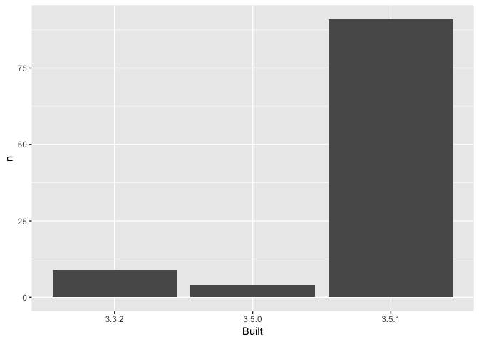

03\_barchart-packages-built.R
================
xoh067
Wed Jan 16 15:53:09 2019

``` r
## remember to restart R here!
library(here)
```

    ## here() starts at /Users/xoh067/Code/2019_rstudio-conf-2019/packages-report

``` r
library(tidyverse)
```

    ## ── Attaching packages ───────────────────────────────────────────────────────────────────── tidyverse 1.2.1 ──

    ## ✔ ggplot2 3.0.0     ✔ purrr   0.2.5
    ## ✔ tibble  1.4.2     ✔ dplyr   0.7.6
    ## ✔ tidyr   0.8.1     ✔ stringr 1.3.1
    ## ✔ readr   1.1.1     ✔ forcats 0.3.0

    ## ── Conflicts ──────────────────────────────────────────────────────────────────────── tidyverse_conflicts() ──
    ## ✖ dplyr::filter() masks stats::filter()
    ## ✖ dplyr::lag()    masks stats::lag()

``` r
## make a barchart from the frequency table in data/add-on-packages-freqtable.csv


## read that csv into a data frame
## hint: readr::read_csv() or read.csv()
## idea: try using here::here() to create the file path
addOnPackagesFreqTable <- read_csv(here("data", "add-on-packages-freqtable.csv"))
```

    ## Parsed with column specification:
    ## cols(
    ##   Built = col_character(),
    ##   n = col_integer(),
    ##   prop = col_double()
    ## )

``` r
## if you use ggplot2, code like this will work:
ggplot(addOnPackagesFreqTable, aes(x = Built, y = n)) +
  geom_col()
```

<!-- -->

``` r
## write this barchart to figs/built-barchart.png
## if you use ggplot2, ggsave() will help
## idea: try using here::here() to create the file path
ggsave(here("figs", "built-barchart.png"))
```

    ## Saving 7 x 5 in image

``` r
## YES overwrite the file that is there now
## that's old output from me (Jenny)
```
